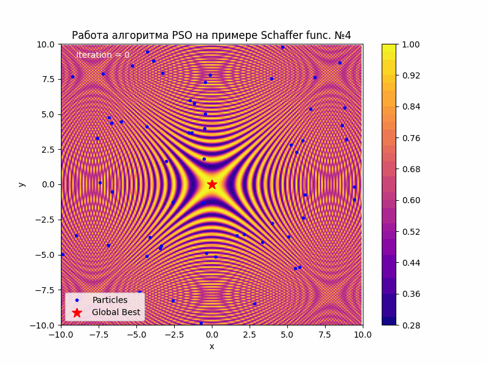
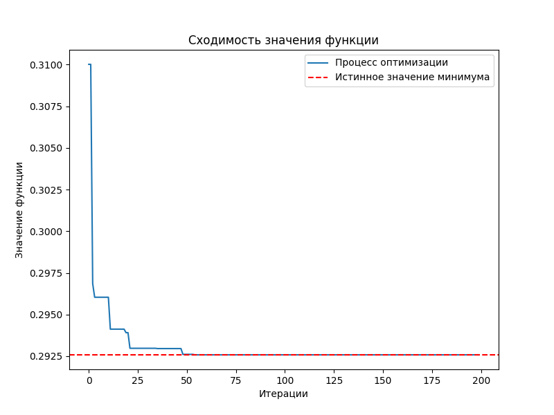
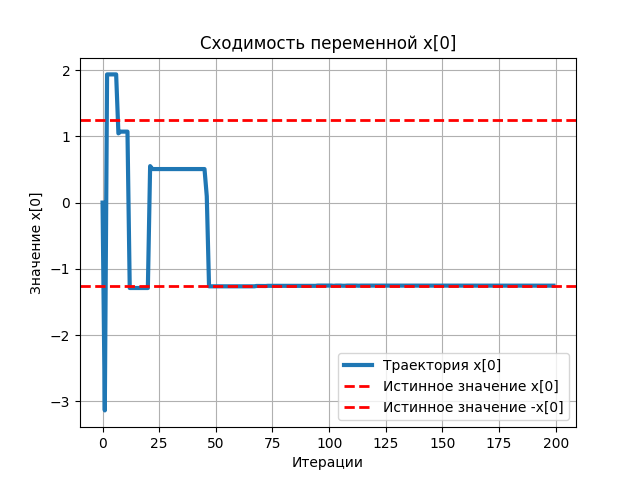
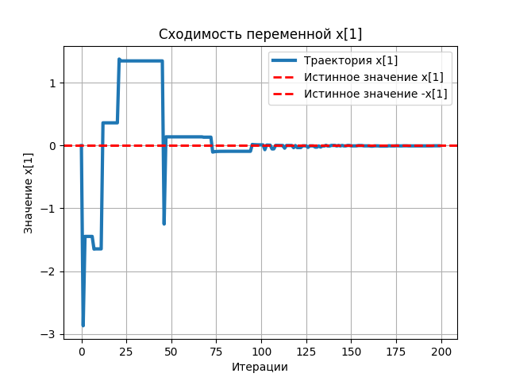

# 📚 Game Theory and Operations Research   (Course Task)

    Реализация двух задач:

### 1. MILP: Simplex Method + Branch and Bound (benchmark: MIPLIB);   2. PSO (Python) + Schaffer function N.4;
#
#
## 🍃 MILP: SM + BrAB

    Coming soon...

#
#
## 🐝PSO: fun. Schaffer N.4
*   ## 📊results + 🔬analysis

    Работа алгоритма при 200 итерациях:

    Траектория значения функции при итерациях:

    Траектория x_0 при итерациях:

    
    Траектория x_1 при итерациях:

### Функция Шаффера номер 4 :
$$
f(x) = 0.5 + \frac{\cos^2\left(\sin\left(\left|x_0^2 - x_1^2\right|\right)\right) - 0.5}{\left(1 + 0.001 \cdot \left(x_0^2 + x_1^2\right)\right)^2}
$$
### Точными значениями глобального миниммума функции были выбраны: (**[Wiki]('https://ru.wikipedia.org/wiki/Тестовые_функции_для_оптимизации)**)
$$
f(0, 1.25313) = 0.292579
$$
### Реализация алгоритма в этом репозитории выдает следующие значения при 200 итерациях:

$$
f(-4.33038583e-04, 1.25312983e+00) = 0.29257863220358526
$$

### В некоторых случаях, алгоритм может выдавать переменные с другим знаком - это нормально из-за симметрии функци и элемента случайности алгоритма
